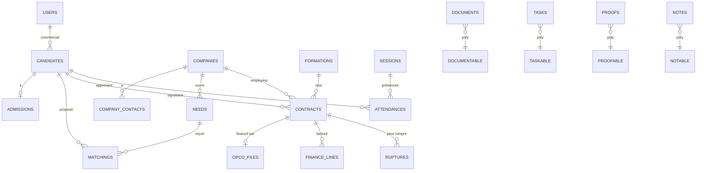

# Modèle de données global — ERP CFA

**À valider ensemble avant de coder** (règle anti-conflits n°1 : valider noms de
tables, champs, statuts et relations avant le développement).

Conventions :
- **Interface 100 % en français** (écrans, libellés, statuts, emails). Les noms
  techniques ci-dessous (tables/colonnes) restent en **anglais** par convention
  Laravel et pour éviter les problèmes d'accents — ils ne sont jamais visibles
  par l'utilisateur (traduits en français à l'affichage via les fichiers de langue).
- Tables en **anglais, pluriel, snake_case** ; clés étrangères `xxx_id`.
- **Soft delete** (`deleted_at`) sur toute entité métier critique.
- Timestamps `created_at` / `updated_at` partout.
- Audit via `spatie/laravel-activitylog` (table `activity_log`).
- Statuts stockés en **enum string** + machine à états (transitions contrôlées).

> Légende relations : `1—n` un-à-plusieurs · `n—n` plusieurs-à-plusieurs (pivot)
> · `poly` relation polymorphe.

---

## 1. Vue d'ensemble (diagramme ER simplifié)

> `DOCUMENTABLE / TASKABLE / PROOFABLE / NOTABLE` = n'importe quelle entité
> (candidat, entreprise, contrat, dossier OPCO, session…).

---

## 2. Socle — Utilisateurs, rôles, référentiels

### `users`
`id, name, email (unique), password, is_active, mfa_secret, last_login_at, deleted_at, timestamps`
- RBAC via spatie : `roles`, `permissions`, `model_has_roles`, `role_has_permissions`.
- **10 rôles** : Administrateur, Direction, Commercial, Admission, Administratif,
  Scolarité, Pédagogie, Finance, Qualité, Formateur.

### `formations` (référentiel)
`id, libelle, code_rncp, niveau, duree_mois, rythme_defaut, is_active, timestamps`

### `opcos` (référentiel)
`id, nom, timestamps`

### `sessions` (groupes / promotions)
`id, formation_id (fk), libelle, date_debut, date_fin, timestamps`

---

## 3. P0 — Parcours principal

### `candidates`  *(la personne ; devient "apprenant" quand un contrat est actif)*
`id, nom, prenom, email (null), telephone (null), date_naissance, adresse,`
`formation_visee_id (fk), niveau_actuel, mobilite, disponibilite, source,`
`commercial_id (fk users), statut, deleted_at, timestamps`
- **Statuts** : `incomplet, complet, en_recherche_entreprise, contrat_signe, rupture`
- **Règles** : email **OU** téléphone obligatoire ; pas de `complet` si pièces
  obligatoires manquantes.

### `companies`
`id, raison_sociale, nom_commercial, siret (unique), adresse, secteur,`
`opco_id (fk null), statut, deleted_at, timestamps`

### `company_contacts`  *(contacts + tuteurs / maîtres d'apprentissage)*
`id, company_id (fk), nom, prenom, email, telephone, fonction,`
`is_principal (bool), is_tuteur (bool), cv_media (medialibrary), timestamps`
- **Règle** : une entreprise sans contact principal ne peut pas avoir de contrat actif.

### `needs`  *(besoins entreprises)*
`id, company_id (fk), intitule_poste, formation_id (fk), localisation,`
`date_demarrage, nb_postes, rythme, prerequis, contact_id (fk company_contacts),`
`tuteur_id (fk company_contacts null), statut, timestamps`
- **Statuts** : `cree, en_qualification, profils_recherches, profils_envoyes,`
  `entretien_prevu, candidat_retenu, pourvu, annule, archive`

### `matchings`  *(proposition candidat ↔ besoin)*
`id, need_id (fk), candidate_id (fk), statut, cv_envoye (bool),`
`date_entretien (null), retour_entreprise (text), assigned_by (fk users), timestamps`
- **Statuts** : `propose, cv_envoye, entretien_prevu, attente_retour, accepte,`
  `refuse_entreprise, refuse_candidat, abandonne`
- **Règle** : pas de `accepte` si le besoin est `pourvu`/`annule`/`archive`.

### `admissions`
`id, candidate_id (fk unique), statut, validated_by (fk users null),`
`validated_at (null), commentaire, timestamps`
- **Statuts** : `a_verifier, incomplet, non_conforme, valide, refuse`
- **Règle** : pas de `valide` tant que des pièces obligatoires manquent / non conformes.

### `admission_checklist_items`
`id, admission_id (fk), document_type, est_obligatoire (bool), statut,`
`document_id (fk documents null), timestamps`
- **Statuts** : `manquante, presente, non_conforme`

### `documents`  *(GED, adossé à medialibrary, poly)*
`id, documentable_type, documentable_id, type, statut, version,`
`previous_version_id (fk null), uploaded_by (fk users), media (medialibrary), timestamps`
- **Types** : cv_candidat, cv_maitre_apprentissage, test_positionnement, contrat,
  cerfa, convention, calendrier, justificatif_absence, preuve_service_fait,
  facture, document_qualite, autre.
- **Statuts** : `en_attente, recu, expire`
- **Règles** : pas de suppression définitive sans trace ; ancienne version
  consultable après remplacement (`previous_version_id`).

### `contracts`
`id, candidate_id (fk), company_id (fk), formation_id (fk), code_rncp,`
`date_debut, date_fin, tuteur_id (fk company_contacts), rythme, lieu_formation,`
`statut_signature, statut_contrat, deleted_at, timestamps`
- **Statut contrat** : `brouillon, infos_manquantes, pret_a_verifier,`
  `envoye_signature, signe, transmis_opco, actif, rompu, archive`
- **Règle** : pas de `signe` sans document signé associé ou justification ; toute
  modif post-signature → nouvelle version / trace.

### `opco_files`  *(dossiers OPCO)*
`id, contract_id (fk unique), opco_id (fk), date_depot (null), statut,`
`montant_prevu, montant_accepte (null), motif_rejet (null),`
`responsable_correction_id (fk users null), date_relance (null),`
`commentaire_interne, timestamps`
- **Statuts** : `non_cree, a_preparer, pret_depot, depose, attente_retour,`
  `accepte, rejete, en_correction, corrige, cloture`
- **Règles** : pas de `pret_depot` si contrat non `signe` ; `rejete` exige
  `motif_rejet` + crée une action de correction.

### `tasks`  *(poly)*
`id, titre, description, taskable_type, taskable_id (null), assignee_id (fk users),`
`created_by (fk users), due_date, priorite, statut, source (manuel/auto), timestamps`
- **Statuts** : `a_faire, en_cours, en_attente, terminee, annulee, en_retard`

### `activity_log`  *(spatie ; journalisation)*
`id, log_name, description, subject_type, subject_id, causer_id (user),`
`properties (json: old/new), created_at`

---

## 4. P1 — Extensions

### `attendances`  *(assiduité)*
`id, candidate_id (fk apprenant), session_id (fk), formation_id (fk),`
`date, statut_presence, duree_prevue, duree_realisee, justificatif_id (fk documents null),`
`commentaire, validateur_id (fk users null), timestamps`
- **Statuts présence** : `present, absent_justifie, absent_injustifie, retard,`
  `depart_anticipe, non_renseigne`
- **Règles** : période non validable si `non_renseigne` ; `absent_injustifie` →
  tâche/alerte ; justificatif rattaché à une absence.

### `service_periods`  *(service fait — validation mensuelle)*
`id, session_id (fk), periode (mois), statut, validated_by (fk users), validated_at, timestamps`

### `finance_lines`
`id, contract_id (fk), opco_file_id (fk null), montant_attendu, montant_accepte,`
`montant_facture, montant_encaisse, montant_bloque, statut_paiement,`
`date_echeance, invoice_id (fk null), motif_blocage, commentaire, timestamps`
- **Statuts** : `previsionnel, a_facturer, facture_preparee, facture,`
  `partiellement_paye, paye, en_retard, bloque, annule`
- **Règles** : facture non émise sans montant + destinataire ; montant bloqué
  exige un motif ; paiement relié à une facture/ligne.

### `invoices`
`id, contract_id (fk), destinataire, montant, date_emission, statut, media, timestamps`

### `proofs`  *(qualité — poly)*
`id, type, proofable_type, proofable_id, statut, indicateur_qualite_id (fk null),`
`mission_cfa_id (fk null), document_id (fk null), source (auto/manuel), timestamps`
- **Statuts** : `validee, refusee, manquante`
- **Types** : entretien_candidat, test_positionnement, recherche_entreprise,
  contrat_signe, livret_pedagogique, presence_assiduite, justificatif, evaluation,
  satisfaction, reclamation, action_corrective, accompagnement_rupture, service_fait.

### `corrective_actions`
`id, proof_id (fk null), libelle, responsable_id (fk users), date_limite, statut, timestamps`

### `ruptures`
`id, contract_id (fk), date_rupture, motif, statut,`
`recherche_nouvel_employeur (bool), timestamps`
- **Statuts** : `suspectee, confirmee, documents_attente, accompagnement,`
  `recherche_employeur, nouveau_contrat, sortie_definitive, cloture`
- **Règle** : `confirmee` exige date + motif ; crée une trace dans contrat, OPCO, finance.

---

## 5. Couche intelligence

### `business_rules`  *(moteur de règles — config)*
`id, code, libelle, declencheur, conditions (json), effet (json), actif (bool), timestamps`
- Évaluées par job Redis et sur transition d'état. Produisent `tasks` + notifications.

### `risk_scores`  *(détection rupture)*
`id, candidate_id (fk), score, niveau (faible/moyen/eleve), facteurs (json),`
`computed_at, timestamps`
- P1 : calcul par règles. P2 : modèle prédictif.

### Relations polymorphes — récapitulatif
| Table | Morph | Rattachable à |
|---|---|---|
| `documents` | `documentable` | candidat, entreprise, contrat, OPCO, session… |
| `tasks` | `taskable` | tout objet métier |
| `proofs` | `proofable` | candidat, apprenant, contrat, entreprise, session |
| `notes` | `notable` | candidat, entreprise, besoin… |
| `activity_log` | `subject` | tout objet métier |

---

## 6. Machines à états — principe d'implémentation

Chaque module a un enum de statuts **et** une table de transitions autorisées
(ou config). Une transition non déclarée est **refusée** (pas de changement de
statut libre). Avantages : workflows fiables, blocages métier centralisés, audit
propre, base saine pour l'automatisation et l'IA.

> Implémentation suggérée : `spatie/laravel-model-states` ou enum PHP + service
> de transition validé par des tests Pest.

---

## 7. Décisions de modélisation à acter ensemble

1. **Personne unique** (`candidates`) qui devient "apprenant" via contrat actif,
   plutôt qu'une table `learners` séparée. ✅ proposé
2. **Tuteurs = `company_contacts`** avec `is_tuteur`, pas de table séparée. ✅ proposé
3. **`documents` adossé à medialibrary** avec versioning via `previous_version_id`. ✅ proposé
4. **Moteur de règles en table config** (`business_rules`) plutôt qu'en dur. ✅ proposé
5. **Mono-site** : pas de notion de campus en V1 (CFA sur un seul lieu). ✅ acté
